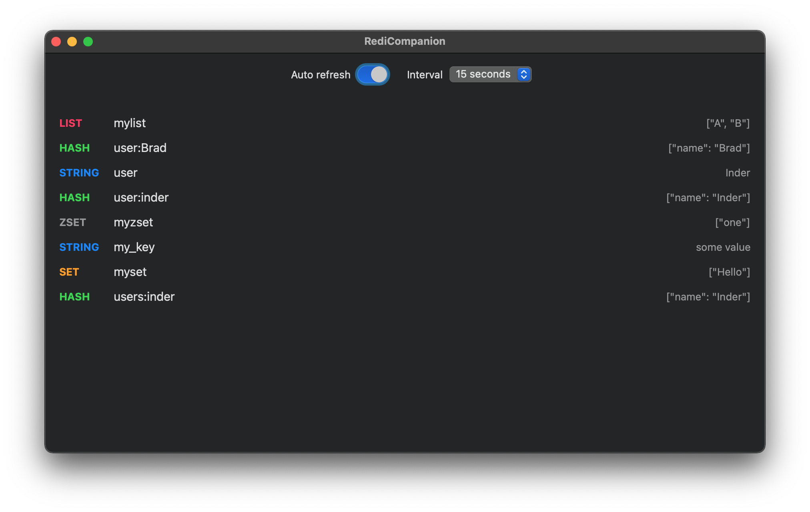

# RediCompanion
RediCompanion is a MacOS app useful for local development to observe changes in Redis store.

It supports macOS 11.+

### This project is still very early in development and its future is unclear. It's currently only meant to be used locally to assist with development.